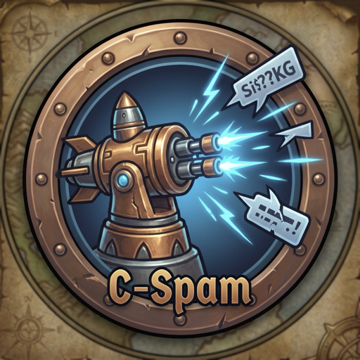

#  C-SPAM: Counter-Spam Phalanx System

**C-SPAM** is an automated in-game chat threat interceptor inspired by military **C-RAM** (Counter-Rocket, Artillery, and Mortar) air defense systems. It tracks, decodes, and neutralizes political discourse, gold/carry advertising, and toxic keywords with zero FPS impact.

---

## 🎯 Why Legacy Chat Filters Fail (And C-SPAM Succeeds)

| Vulnerability in Common Addons | C-SPAM Phalanx Defense |
|---|---|
| **Misses words due to punctuation** (`"trump!"`, `"(biden)"`, `"kamala,"`) | **Boundary Isolation Engine**: Automatically strips punctuation before matching. |
| **Bypassed by Leetspeak / Homoglyphs** (`@ss`, `tr0mp`, `b!den`, Russian Cyrillic lookalikes) | **Camouflage & Leet Decoder**: Normalizes `@` $\rightarrow$ `a`, `0` $\rightarrow$ `o`, `$` $\rightarrow$ `s`, `1` $\rightarrow$ `i`, `v` $\rightarrow$ `u`, and Cyrillic homoglyphs (`а`, `е`, `о`, `р`, `с`) to Latin base characters. |
| **High Trade/LFG Channel Lag** | **$O(1)$ Hash Set Engine**: Single words evaluate in microsecond time ($O(N)$ where $N$ is only the word count of the incoming sentence). High-volume duplicate spam lines are resolved instantly from a fast LRU hash cache. |
| **Item/Spell Links Broken or False-Triggered** | **Hyperlink Shield**: Shields all `|c...|Hitem:...|h[Name]|h|r` links so item names, hex color codes, and item IDs never trigger false positives or break in chat. |
| **False-Positive Substrings** | Strict separation between **Exact Standalone Words** (blocking `"trump"` will **never** block `"strumpet"` or `"trumpet"`), **Contains**, and **Phrases**. |

---

## 🛠️ Features

- ⚙️ **ElvUI-Themed Tactical Console**: Sleek 1-pixel borders, matte charcoal panels, cyan/red accenting, and informative inline tooltips with concrete examples.
- 🛸 **Custom Minimap Turret Button**: Draggable circular turret button with live hover telemetry (*Airspace Scanned*, *Threats Intercepted*, *% Intercept Rate*) and 1-click console access.
- 📦 **1-Click Pre-Calibrated Defense Packs**:
  - 🏛️ **Political Discourse**: Candidates, elections, partisan arguments, and campaign phrases.
  - 💰 **Carries, Boosting & Gold Spam**: M+ carry ads, raid loot sales, AFK leveling, and external Discord/gold seller links.
  - 🚫 **Toxicity & Hostile Slurs**: Severe harassment, toxicity, and unmoderated hate speech.
- 🛡️ **IFF Safe Allies (Bypasses)**: Automatic bypasses for Battle.net/character Friends, Guildmates, and Party/Raid group members.
- 📡 **Monitored Airspace**: Per-channel radar toggles for Public Channels (Trade, Services, General, LFG), Communities, Local Say/Yell, and Direct Whispers.
- 🎯 **Dual Engagement Protocols**:
  - **Kinetic Intercept**: Silently drops matching messages completely (zero chat clutter or sound).
  - **Electronic Jamming**: Censoring matched keywords with `***` while keeping all item/spell links safe.
- 📋 **Import / Export**: Easily export and share your threat signatures (`MODE:KEYWORD`) with guildmates.

---

## 🎮 Tactical Slash Commands

| Command | Action |
|---|---|
| `/cs` or `/cspam` | Open the **C-SPAM Tactical Defense Console** |
| `/cs toggle` | Quick toggle **ARM / DISARM** intercept status |
| `/cs add <word>` | Register an exact signature to the Threat Matrix |
| `/cs stats` | Output telemetry report to chat |

---

## 📥 Installation

1. Download the latest release.
2. Extract the `CSPAM` folder into your World of Warcraft directory:
   `World of Warcraft\_retail_\Interface\AddOns\CSPAM\`
3. Launch WoW (or type `/reload` in-game).
4. Type `/cs` or click the Minimap Turret icon to configure.

---

## 📜 Blizzard Addon Policy Compliance

- **100% Free & Open Source**: No paywalls, paid tiers, or monetization.
- **Official APIs**: Uses standard `ChatFrame_AddMessageEventFilter` APIs.
- **Client-Side Only**: Does not execute external out-of-game code or violate the Terms of Service.
